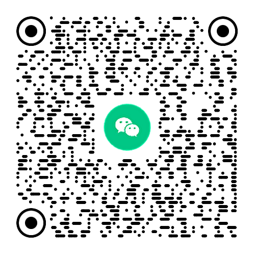

## TYPECHO文字博客主题：OneBlog 一款简约清新文艺的写作记录类单栏主题

<a href="https://oneblogx.com"></a>

### 项目简介

OneBlog，一个博客，再无其他。本主题基于Typecho，设计初衷是写作本身，并无太多其他功能，是一款简约清新文艺风格的写作记录类文字博客主题，适合生活记录、文学作品、个人日志等文字类博客，非文字类博客请慎用。OneBlog主题由[彼岸临窗](https://oneblogx.com/)精心打磨多年，且持续优化，现免费开源，致敬互联网社区开源精神，也致敬热爱生活和记录的我们。

**最新版本：V3.5.2**

### 主题特性

✅ **极致的性能，页面加载平均仅需0.03 s；**

✅ **流畅的体验，无限加载+自动加载数据+图片懒加载；**

✅ **极致的简约风，扁平化设计，简约而不简单；**

✅ **符合美学的松弛美感，精益求精的留白，让每一次访问都是一种享受；**

✅ **精雕细琢，精致而优雅的移动端界面；**

**✅ 支持切换PC端护眼模式+移动端黑夜模式；**

✅ **注释齐全，代码精简，基于OneBlog，你可以最大限度地实现自定义效果。**

### 主题功能

- [x] 文章，聚焦文字本身，沉浸式阅读体验；
- [x] 相册，支持一键同步Unsplash作品；
- [x] 书单，不依赖第三方api，支持记录读书笔记；
- [x] 微语，前台登录和发布，抓住转瞬即逝的灵感；
- [x] 友链，每一位邻居都值得被珍惜和被看见；
- [x] 评论，下拉自动加载；~~评论者地域显示~~（版本号≥3.4.1已移除该功能）
- [x] 归档，干净利落的博客归档页面；
- [x] 搜索，友好的交互体验。

### 开发计划

本主题的开发计划已全部完成，已知问题已全部修复，合理需求已全部满足，如果你在使用过程中发现任何问题请优先通过本项目的Issues反馈或微信群反馈。对于新功能的建议，请认真了解本主题的设计初衷和官网博客的内容方向后提出，合理化建议会在后续的维护更新中采纳。

### 使用文档

主题文档：[docs.oneblogx.com](https://docs.oneblogx.com)

首发地址：[oneblogx.com/oneblog](https://oneblogx.com/oneblog)

### 版权声明

本主题的所有外观设计专利及软件著作权均归 [©彼岸临窗](https://oneblogx.com) 所有，并已取得中华人民共和国国家版权局颁发的计算机软件著作权登记证书（登记号：2025SR0334142）和外观设计专利证书（证书号：第7121519号），作者保留所有权利。致敬开源，本主题自2025年1月1日起，以GPL-2.0协议授权广大用户免费使用。任何个人或单位在注明来源的基础上，均可以免费无偿使用本主题，但不得以任何形式售卖（包括但不限于以付费下载、积分购买、vip用户可见等形式向用户提供下载链接，下同），否则视为侵权。基于GPL-2.0协议，本主题允许在保留来源（同时包含署名和链接）的基础上对源代码进行修改，但修改后的源码只能自己使用或免费开源，不得以任何形式售卖。

### 赞助本项目

**开源不易，记得点★Star，支持作者。**

你的关注和赞助是这个项目维护下去的坚实动力。

|                        打赏作者                        |                   加入主题交流群                   |
| :----------------------------------------------------: | :------------------------------------------------: |
|  |  |

欢迎加入官方微信群，作者会及时更新微信群二维码，如已失效，请添加微信：**oneblogx** 或通过公众号：**彼岸临窗** 私信获取最新群二维码。

### 主题预览

更多功能模块的演示请访问主题官网了解：[oneblogx.com](https://oneblogx.com)


### 版本更新记录

```
V3.5.2版本更新
1.主题内置自定义菜单；
2.PC端页脚支持显示icp备案号和公安联网备案号；
3.主题文档全新上线；
4.其他细节优化。

V3.5.1版本更新
1.文章缩略图逻辑优化；
2.文章列表页缩略图支持自定义图像处理参数；
3.优化归档页样式、文章列表间距；
4.修复移动端黑夜模式下猜你喜欢的文章无法点击的bug；
5.修复移动端黑夜模式下logo显示为护眼模式logo的bug；
6.修复PC端搜索页面错位bug；
7.优化页面/文章关闭评论且没有评论时底部间距过窄的bug。

V3.5版本更新
1.主题重构，全站性能优化，精简合并所有通用类，规范重写前端样式；
2.新增搜索功能；
3.新增PC端护眼模式和移动端黑夜模式；
4.优化表情模块，兼容CommentNotifier插件，实现邮件通知中也能显示表情；
5.评论区细节优化；
6.优化分类页面、标签页面显示逻辑；
7.支持自定义主题配色；
8.优化重复点赞提示；
9.修复全部已知BUG。

V3.4.3版本更新
1.新增归档页面；
2.新增独立页面模板：无图单页；
3.性能优化，速度更快；
```
