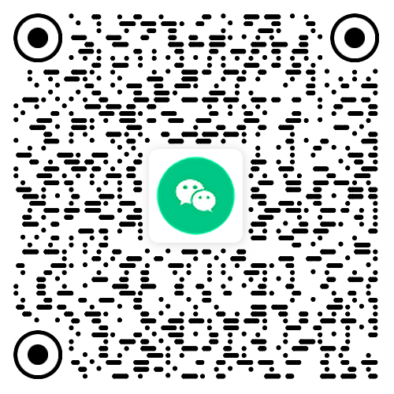

## 【免费开源】TYPECHO文字博客主题：OneBlog主题

**本主题的所有外观设计专利及软件著作权均归 [©彼岸临窗](https://blog.luziyang.cn) 所有，作者保留所有权利。**

**当前版本**：V3.3

OneBlog，一个博客，再无其他。本主题的设计初衷是写作本身，并无太多其他功能，是一款简约清新文艺风格的写作记录类文字博客主题，适合生活记录、文学作品等文字类博客。OneBlog主题由[彼岸临窗](https://blog.luziyang.cn/)精心打磨多年，且持续优化，现免费开源，致敬Typecho以及开源精神，也致敬热爱生活和记录的我们。

#### 主题特性：

✅ **极致的性能，页面加载平均仅需0.03 s；**

✅ **极致的简约风，扁平化设计；**

✅ **极致的松弛美感，精益求精的留白，让每一次访问都是一种享受；**

✅ **精致而优雅的移动端界面。**

主题详细介绍及安装教程文档请通过以下官网查看：

**OneBlog主题官网：**[oneblog.me/theme/](https://oneblog.me/theme/)  (备案期间请通过备用地址访问)

备用地址：[OneBlog主题官网](https://www.coolnav.com/oneblog/)

官方发布页面（可留言互动）：：[https://blog.luziyang.cn/oneblog.html](https://blog.luziyang.cn/oneblog.html)

**开源不易，记得点★Star，支持作者。**

|                       打赏作者                       |                     加入主题交流群                      |
| :--------------------------------------------------: | :-----------------------------------------------------: |
|  |  |

主题预览（更多演示请访问主题官网了解）：

